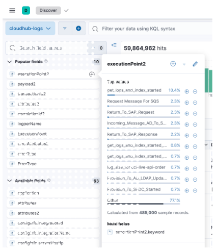
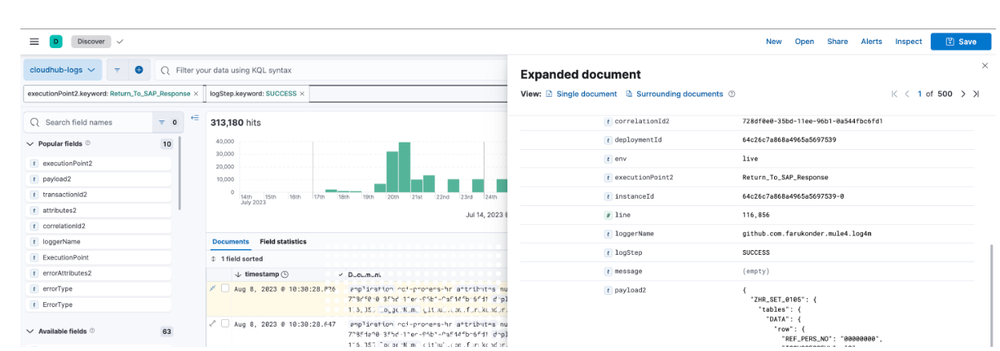
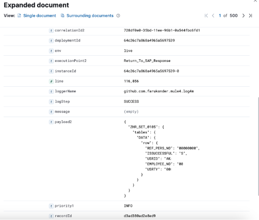
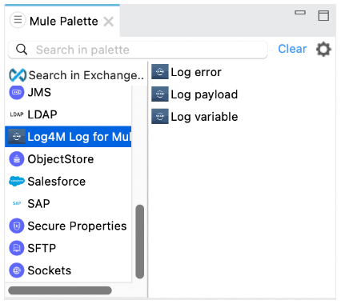
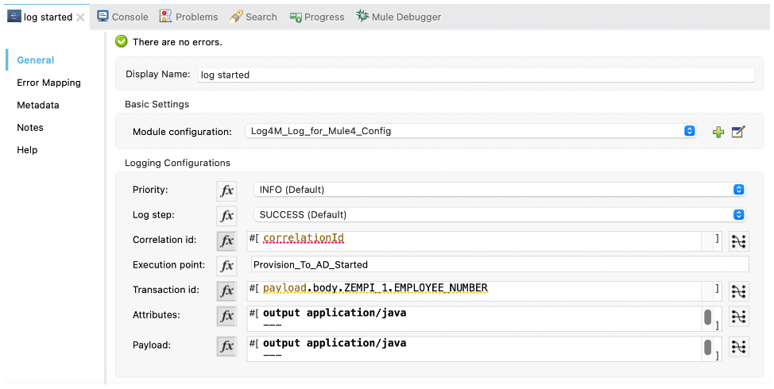

# Log4m connector for mule4

[blog](https://farukonder.github.io/thats-enough-cloud-for-today/blog/2023/11/20/log4m-for-mulesoft.html)


Mule comes with built-in log activity, but it has some limitations. The log4m connector, however, enhances the default features by incorporating additional capabilities.
 - Built-in JSON logger
 - Correlation ID (choose between default correlation ID or a custom one)
 - Transaction ID (business transaction ID)
 - Log type (SUCCESS or FAIL)
 - Execution point name
 - Attributes of the execution point in the flow
 - Payload:
 - - Payload
 - - Error payload (in case of flow errors)
 - - HTTP response payload (detailed information in case of HTTP errors, without requiring additional configuration)"


with combining this connector with elasticsearch, its really easy to classify any flow logs based on above fields easily.



elasticsearch classification



elasticsearch flow trace with details



## using in anypoint

after adding the connector, below is the usage details.

anypoint studio palette



aynpoint action details



## compile

```sh
mvn clean package -DskipTests
```

## define in pom.xml

Add this dependency to your application pom.xml

```xml
<dependency>
	<groupId>github.com.farukonder.mule4.connectors</groupId>
	<artifactId>mule-log4m-connector</artifactId>
	<version>0.0.1</version>
    <classifier>mule-plugin</classifier>
</dependency>
```

## publish

put below xml snipped in your pom.xml file. and run mvn deploy in order to put this jar to artifact repository

```xml
	<distributionManagement>
		<repository>
			<id>cci-repo-mule</id>
			<url>https://pkgs.dev.azure.com/$organization/$project/_packaging/repo-mule/maven/v1</url>
		</repository>
		<snapshotRepository>
			<id>cci-repo-mule</id>
			<url>https://pkgs.dev.azure.com/$organization/$project/_packaging/repo-mule/maven/v1</url>
		</snapshotRepository>
	</distributionManagement>
```

**know issues**

issue:1 There's no XML files that has a <module> root element, thus is impossible to auto generate a [mule-artifact.json] descriptor file. The file must start with [module-] and end with [.xml], such as [module-foo.xml] 

fix:1 set JAVA_HOME like
```sh
export JAVA_HOME=/Library/Java/JavaVirtualMachines/jdk1.8.0_301.jdk/Contents/Home
```